# AndroidStudio每日一贴

## 《AndroidStudio每日一贴》1.快速打开方法或字段

在编辑器中快速打开某个方法或字段, 使用快捷键: option + command + o(Navigate | Symbol) 然后开始输入名字.

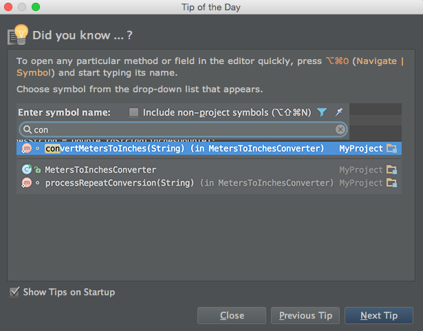

更多实用技巧请查看[《AndroidStudio实用指南》](http://yuedu.baidu.com/ebook/31beb61a9b6648d7c1c746e8)

博客: http://blog.csdn.net/wirelessqa 作者: 老毕  

## 《AndroidStudio每日一贴》2.快速查看项目中最近的变更

快速查看项目中最近的变更,使用快捷键: option + shift +c

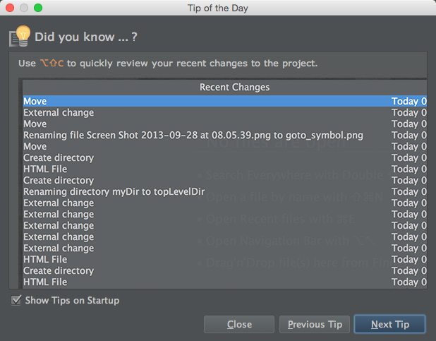

更多实用技巧请查看[《AndroidStudio实用指南》](http://yuedu.baidu.com/ebook/31beb61a9b6648d7c1c746e8)

博客: http://blog.csdn.net/wirelessqa 作者: 老毕  

## 《AndroidStudio每日一贴》3.快速切换代码风格、配色方案和键盘

快速切换代码风格、配色方案和键盘,使用快捷键: control + ~

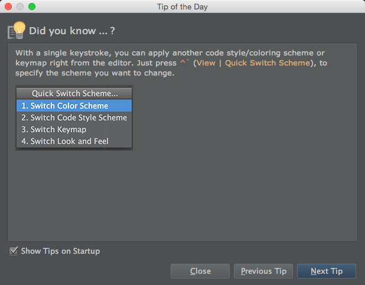

更多实用技巧请查看[《AndroidStudio实用指南》](http://yuedu.baidu.com/ebook/31beb61a9b6648d7c1c746e8)

博客: http://blog.csdn.net/wirelessqa 作者: 老毕  

## 《AndroidStudio每日一贴》4.如何快速插入引用？

### 操作方法:

向当前正在编辑的字段/方法/类/文件中插入引用,可以使用Edit | Copy Reference 或 快捷键 option + command + shift + c

### 举个例子:

如下图所示，

第一步: 在Collection.java中,光标放在EMPTY_MAP上面, 使用快捷键 option + command + shift + c
第二步: 回到你要插入这个引用的地方, 按下command + v, Collections.EMPTY_MAP就会插入了.

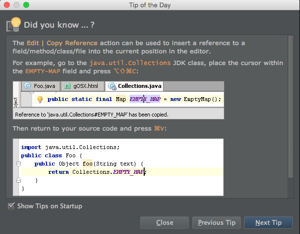

更多实用技巧请查看[《AndroidStudio实用指南》](http://yuedu.baidu.com/ebook/31beb61a9b6648d7c1c746e8)

博客: http://blog.csdn.net/wirelessqa 作者: 老毕  

## 《AndroidStudio每日一贴》5. 如何快速查看某个方法/注解的定义？

### 操作方法:

使用快捷键 option + space 或 command + y

### 举个例子:

如下面的例子,我在输入@O的时候会出现代码补全列表,这个时候我想查看列表中项目的定义可以使用快捷键 option + space 或 command + y来查看.

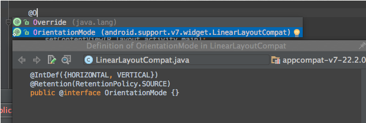

查看方法的定义同上.使用快捷键 option + space 或 command + y来查看.

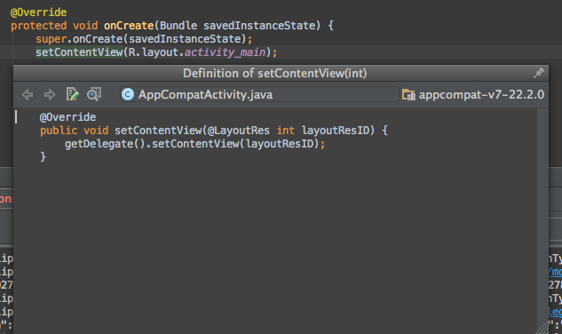

更多实用技巧请查看[《AndroidStudio实用指南》](http://yuedu.baidu.com/ebook/31beb61a9b6648d7c1c746e8)

博客: http://blog.csdn.net/wirelessqa 作者: 老毕  

## 《AndroidStudio每日一贴》6. 如何使用基础的自动补全?

### 操作方法:

option + 空格  (如果跟电脑的快捷键冲突,你可以到keymap中去自定义快捷键)

可以在Java或其它类型的文件中使用自动补全.

### 举个例子:

在Java文件中输入set，然后按下 option + 空格,会出现自动补全列表.
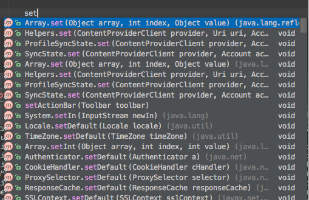

如下图, .properties文件中使用方法也是一样的.
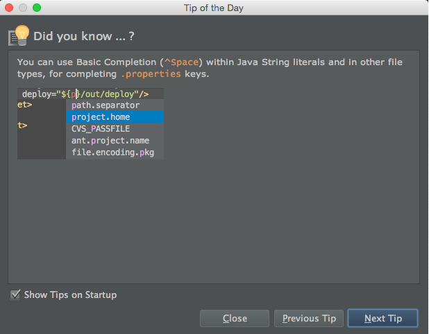

更多实用技巧请查看[《AndroidStudio实用指南》](http://yuedu.baidu.com/ebook/31beb61a9b6648d7c1c746e8)

博客: http://blog.csdn.net/wirelessqa 作者: 老毕  

## 《AndroidStudio每日一贴》7. 如何将本地变更文件移到其它的changelist？

### 操作方法:

进入Version Control —> Local Changes ，会显示本地变更列表分组.

如果你想将某个changelist中的文件转移到其它的changelist,
选中此文件,在弹出的菜单中选择 [Move to Another Changelist].

如下图:

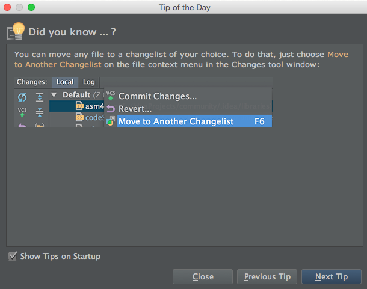

然后你可以选择已存在的changelist,或自己新建一个.

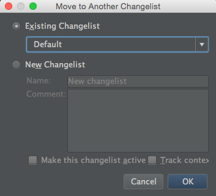

更多实用技巧请查看[《AndroidStudio实用指南》](http://yuedu.baidu.com/ebook/31beb61a9b6648d7c1c746e8)

博客: http://blog.csdn.net/wirelessqa 作者: 老毕  

## 《AndroidStudio每日一贴》8. 如何关闭除了当前文件以外的所有文件？

### 操作方法:

两个方法:

方法一. 右击当前打开的标签，选择[Close Others]

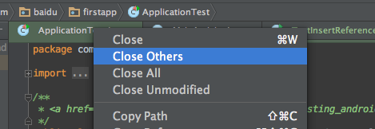

方法二. 点击当前文件标签右上角的叉叉按钮

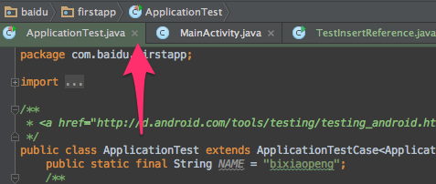

更多实用技巧请查看[《AndroidStudio实用指南》](http://yuedu.baidu.com/ebook/31beb61a9b6648d7c1c746e8)

博客: http://blog.csdn.net/wirelessqa 作者: 老毕  

## 《AndroidStudio每日一贴》9. 如何使用导航栏快速切换项目中的视图？

### 操作方法:

导航栏可以快速切换项目中的视图显示。

使用command + 向上键头显示导航栏,然后使用方向键来定位你要查看的文件或文件夹.

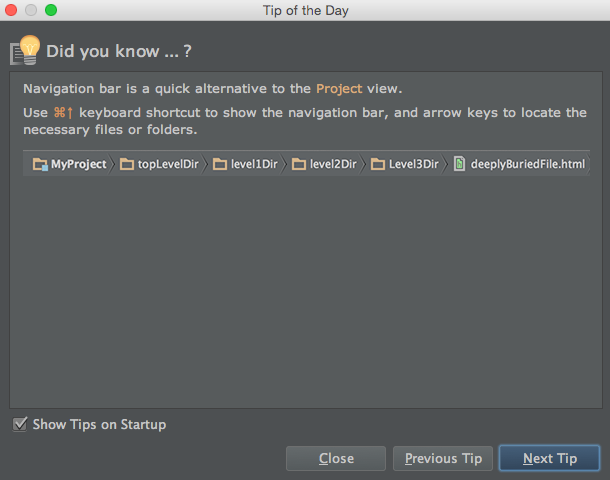

更多实用技巧请查看[《AndroidStudio实用指南》](http://yuedu.baidu.com/ebook/31beb61a9b6648d7c1c746e8)

博客: http://blog.csdn.net/wirelessqa 作者: 老毕  
